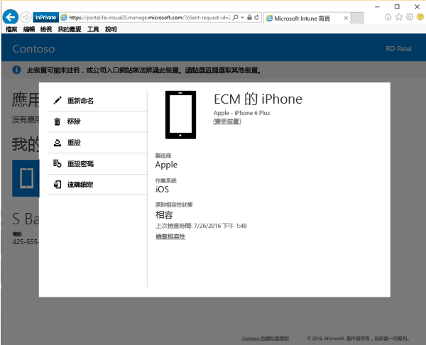

# 從公司入口網站重新命名裝置

您可以決定要重新命名裝置，以利識別。 您可以從[公司入口網站](http://portal.manage.microsoft.com)執行此工作。 公司入口網站是您可用來管理已向 IT 部門註冊管理之電腦和裝置的網頁。

若要重新命名裝置：

1.    在[公司入口網站](http://portal.manage.microsoft.com)上，點選 [功能表] 按鈕，然後選取 [我的裝置]。

2. 在 [我的裝置] 頁面上，選取您想要重新命名的裝置名稱。

  ![[我的裝置] 頁面的螢幕擷取畫面，在橫幅提示上方有一些無法辨識的裝置，橫幅提示要註冊未列出的裝置，或找出無法辨識的裝置。](./media/macOS_enroll_002_tap_here_banner.png)

3.    裝置會在快顯視窗中開啟。 點選 [重新命名] 按鈕。

    

4.  在裝置名稱出現的方塊中，鍵入裝置的新名稱，然後點選 [重新命名] 按鈕。 您的裝置現在以新的名稱出現。

是否仍需要協助？ 請連絡 IT 系統管理員。 如需連絡資訊，請查看[公司入口網站](http://portal.manage.microsoft.com)。

