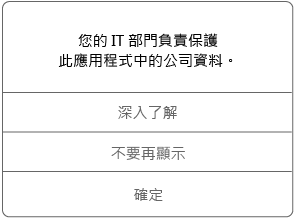

# 在 Android 裝置上使用受管理的應用程式

受管理應用程式是公司支援人員可以設定來協助保護公司資料的應用程式，您可以在該應用程式中存取這些資料。 當您在 Android 裝置上存取受管理應用程式中的公司資料時，可能會注意到，應用程式的運作方式與您的預期有點不同。 例如，您可能無法複製並貼上受保護的公司資料，或可能無法將該資料儲存至特定位置。

不同的受管理應用程式也可能在您的裝置上一同運作，讓您可以執行日常工作，同時持續保護公司資料。 例如，如果您在一個受管理的應用程式中開啟公司檔案，而另一個受管理的應用程式被要求檢視該檔案，可讓您檢視檔案的受管理應用程式會自動開啟。 如果可用的特定動作的不必要的應用程式，像是開啟文件或存取網頁連結從受管理的文件，可能無法使用。

當您在受管理應用程式中存取公司資料時，您會看到如下的訊息，它可讓您知道您開啟的應用程式受到管理。

## 如何取得受管理的應用程式？
您可利用數個不同方是取得受管理的應用程式︰

-   當您在 Microsoft Intune 中註冊您的裝置，可從公司入口網站應用程式或公司入口網站安裝應用程式，或者您公司的支援人員可能會將它安裝在您的裝置上。 若要深入了解註冊，請參閱[在 Intune 中註冊您的裝置](enroll-your-device-in-Intune-android.md)。

-   您從 Play Store 安裝應用程式，然後使用由 Intune 管理的公司使用者帳戶登入。

## 公司支援人員可以在應用程式中管理的項目為何？
以下是您公司的支援人員可以在應用程式中管理，以及可能影響您在裝置上與公司資料互動的一些選項範例︰

-   特定網站的存取

-   應用程式之間傳送資料

-   儲存檔案

-   複製和貼上作業

-   PIN 存取需求

-   您的登入，使用公司認證

-   備份至雲端的功能

-   擷取螢幕擷取畫面的功能

-   資料加密需求

可能用來管理您的 IT 部門的一些常見應用程式如下：

-   Intune Managed Browser

-   Intune Image Viewer

-   Intune PDF Viewer

-   Intune AV Player

-   Microsoft Word、Excel 和 PowerPoint

如需您裝置上受管理應用程式的詳細資訊，請連絡公司支援人員。 如需連絡資訊，請查看[公司入口網站](https://portal.manage.microsoft.com#HelpDeskDialog)。
