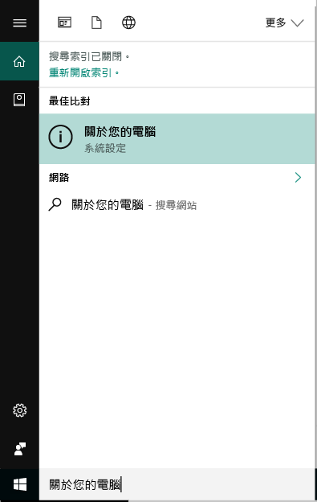

# Windows Intune 公司入口網站中的裝置註冊  

註冊 Windows 裝置中的 Intune 公司入口網站應用程式，以取得工作和學校應用程式、 電子郵件和檔案的安全存取。 如果您的組織需要或建議特定的應用程式，例如 Office 或 OneDrive，您會收到其在註冊期間，或它們都可在公司入口網站中註冊之後。  

您可以透過公司入口網站的 Windows 10 裝置註冊*或*應用程式。 如果您要註冊舊版 Windows 的裝置，您必須註冊的裝置，透過公司入口網站。  

## 安裝公司入口網站應用程式  
您可能已在裝置上安裝公司入口網站應用程式。 中的應用程式檢查您__所有應用程式__清單。  如果應用程式清單中找不到 [公司入口網站]，請遵循下列步驟來安裝。  

1. 開啟**Microsoft Store**您裝置上。

2. 在 **搜尋**欄位中，輸入**公司入口網站**。

3. 在結果清單中，選取 [公司入口網站] > [安裝]。

4. 選取 [安裝] 或 [免費]。 沒有這兩個選項; 之間的差異文字會顯示根據您的組織設定應用程式的方式。  

## 尋找 Windows 10 版本號碼  
不同版本的 Windows 10 裝置的註冊步驟有所不同。 下列步驟說明如何尋找版本號碼在 Windows 10 桌上型電腦和行動裝置。 您知道您的版本之後，繼續使用建議的註冊步驟。  

### Windows 10 Desktop 裝置  

1. 移至 [開始]。

2. 在 搜尋 列中，輸入 片語 「 關於您的電腦。 」 選取 __關於您的電腦__從結果中。  

     

3. 向下捲動至**Windows 規格**若要尋找**版本**安裝在您的電腦上的 Windows 10。  

     

4. 如果您的版本  

    *  __1607 或更新版本__： 註冊您的裝置，透過[**設定** > **帳戶** > **存取公司或學校**路由](enroll-windows-10-device.md#enroll-windows-10-version-1607-and-later-device)。   
    * __1511 或較早__： 註冊您的裝置，透過[**設定** > **帳戶** > **您的帳戶**路由](enroll-windows-10-device.md#enroll-windows-10-version-1511-and-earlier-device)。  

### Windows 10 Mobile 裝置       

1.  移至__所有應用程式__，然後選取__設定__應用程式。  
2.  選取 [系統] > [關於]。      
3.  底下__裝置資訊__，尋找__版本__。  
4. 如果您的版本  

    *  __1607 或更新版本__： 註冊您的裝置使用[**設定** > **存取公司或學校**路由](enroll-windows-10-device.md#enroll-windows-10-version-1607-and-later-device)。   
    * __1511 或較早__： 註冊您的裝置使用[**設定** > **帳戶**路由](enroll-windows-10-device.md#enroll-windows-10-version-1511-and-earlier-device)。  

## 註冊非 Windows 10 裝置  
若要註冊其他支援的 Windows 裝置，透過公司入口網站中使用下列文章：   
* [Windows 8.1 或 Windows RT 8.1 裝置](enroll-your-W81-or-rt81-windows.md)  
* [Windows Phone 8.1 裝置](enroll-your-wp81-windows.md)    

## 後續步驟  
您現在知道支援的裝置，以及 Windows 10 版本號碼，請繼續進行建議的註冊文件。  
 
如需裝置管理的詳細資訊，公司入口網站，以及如何同時使用在學校和工作，請參閱下列文章：  
* [使用受控裝置來存取公司或學校資源](use-managed-devices-to-get-work-done.md)  
* [當您在 Intune 註冊您的裝置時，會發生什麼情況](what-happens-if-you-install-the-company-portal-app-and-enroll-your-device-in-intune-windows.md)  
* [當我註冊裝置時，我的組織可以看到哪些資訊？](what-info-can-your-company-see-when-you-enroll-your-device-in-intune.md)  

需要協助嗎？ 請連絡您公司的支援人員。 [移至 公司入口網站](https://go.microsoft.com/fwlink/?linkid=2010980)來尋找組織的 IT 連絡人資訊。  
