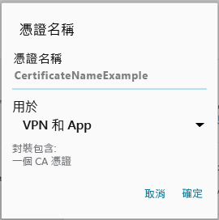

# 您的 Android 裝置遺失公司支援人員所要求的憑證

如果您的裝置未在 Intune 註冊，且遺失公司支援人員所要求的特定憑證，您就無法登入公司入口網站應用程式。 當您嘗試登入時，您會看到下列訊息：

若要修正此問題，並取得所需的憑證，您必須執行兩個主要步驟：

- 透過公司或學校電腦上尋找以識別遺失的憑證。
- 使用您的裝置從網際網路下載遺失的憑證。

## 透過公司或學校電腦上尋找以識別遺失的憑證

1. 在電腦上開啟 Internet Explorer。 如果您沒有可用於此用途的電腦，請連絡公司支援人員。 如需公司支援人員的連絡資訊，請查看[公司入口網站](https://portal.manage.microsoft.com#HelpDeskDialog)。

2. 請移至[公司入口網站](https://portal.manage.microsoft.com#HelpDeskDialog)，並使用您的公司或學校認證登入。

3. 在瀏覽器的網址列最右側，選擇看似掛鎖的符號，如下方螢幕擷取畫面所示。

    

    如果未顯示掛鎖符號，請停止作業，並連絡您公司的支援人員。 鎖頭符號表示您已經安全地登入，因此除非您看到該符號，否則不應該繼續。

4. 按一下 [檢視憑證]。

    

5. 在 [憑證] 對話方塊中，選擇 [憑證路徑] 索引標籤，然後找出您需要從網際網路取得的憑證。 您可在上述範例螢幕擷取畫面中反白顯示之憑證的相同位置，找到所需憑證的名稱。

## 在您的 Android 行動裝置上下載並安裝遺失的憑證

1. 使用搜尋引擎 (例如 Bing 或 Google) 搜尋您在上一節中識別的遺失憑證名稱。 憑證可能會以不同的副檔名結束，例如 ".crt" 或 ".pem" 等。

2. 從網站下載根憑證。

3. 下載憑證之後，從您的裝置頂端下拉以開啟通知，然後點選通知清單中的憑證名稱。

4. 在下方螢幕擷取畫面顯示的 [命名憑證] 對話方塊中，接受預設憑證名稱。

5. 請確認 [認證使用] 設為 [用於 VPN 和應用程式]，然後點選 [確定]。

    

6. 關閉公司入口網站應用程式。

7. 重新開啟公司入口網站應用程式。 您現在應該能夠登入公司入口網站應用程式。 如果您需要協助，請連絡您公司的支援人員。

如果您已經遵循相關步驟，卻仍顯示上述相同的「遺失憑證」訊息，可能表示您需要公司支援人員協助安裝其他憑證。 請使用可在[公司入口網站](https://portal.manage.microsoft.com#HelpDeskDialog)取得的連絡資訊來連絡您公司的支援人員以取得協助。
